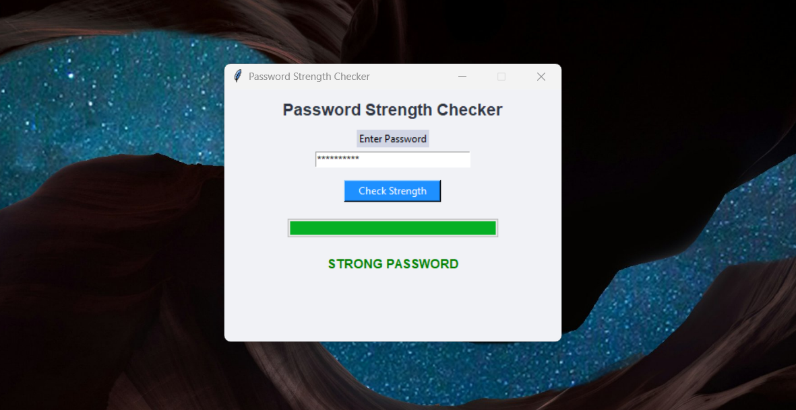

# 🔐 Password Strength Checker (Python GUI)



A simple **Password Strength Checker Tool** built using **Python & Tkinter GUI**.

This project is created as **Task 02** for **Prodigy InfoTech Cyber Security Internship**.

---

## ✨ Features

- Checks password strength (Weak / Medium / Strong)
- Progress bar visualization
- Hides password input
- Beginner friendly GUI
- Simple security rules

---

## 🛠️ Technologies Used

- Python 🐍
- Tkinter
- VS Code

---

## 📸 Screenshot


---

## 🚀 How To Run

1. Check Python installation:

```bash
python --version
```

2. Run program:

```bash
python task02_password_checker.py
```

---

## 🧠 Strength Rules Used

- Minimum length 8 characters
- Uppercase letter
- Lowercase letter
- Number
- Special character

---

## 📂 Project Structure

```
Password-Strength-Checker/
│
├── password_checker.py
├── README.md
└── screenshot.png
```

---

## 🙌 Author

**Ritim Ghusraan**  
Cyber Security Intern — Prodigy InfoTech  

---

⭐ Give a star if you like this project!
